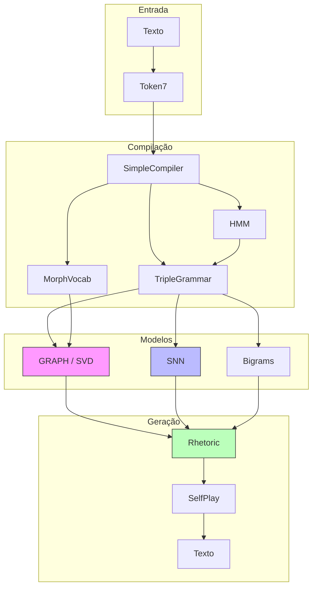
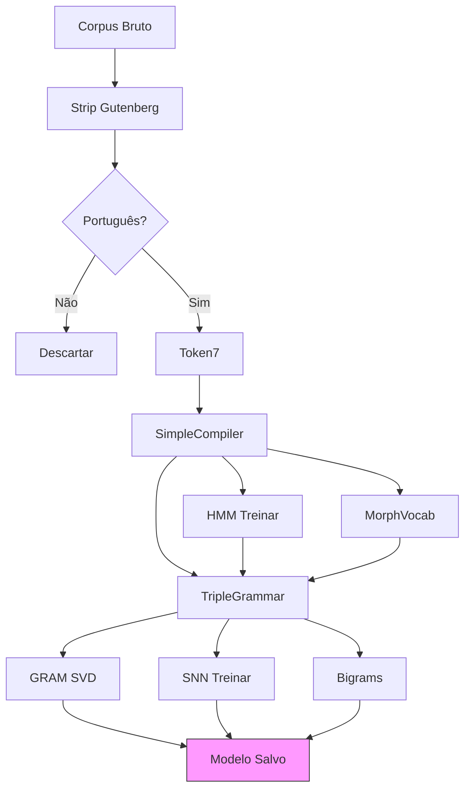
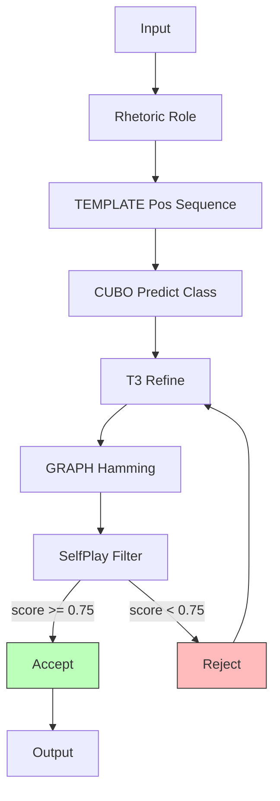
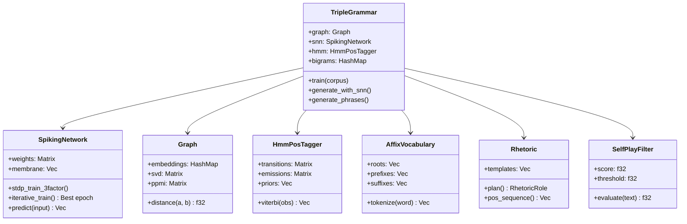
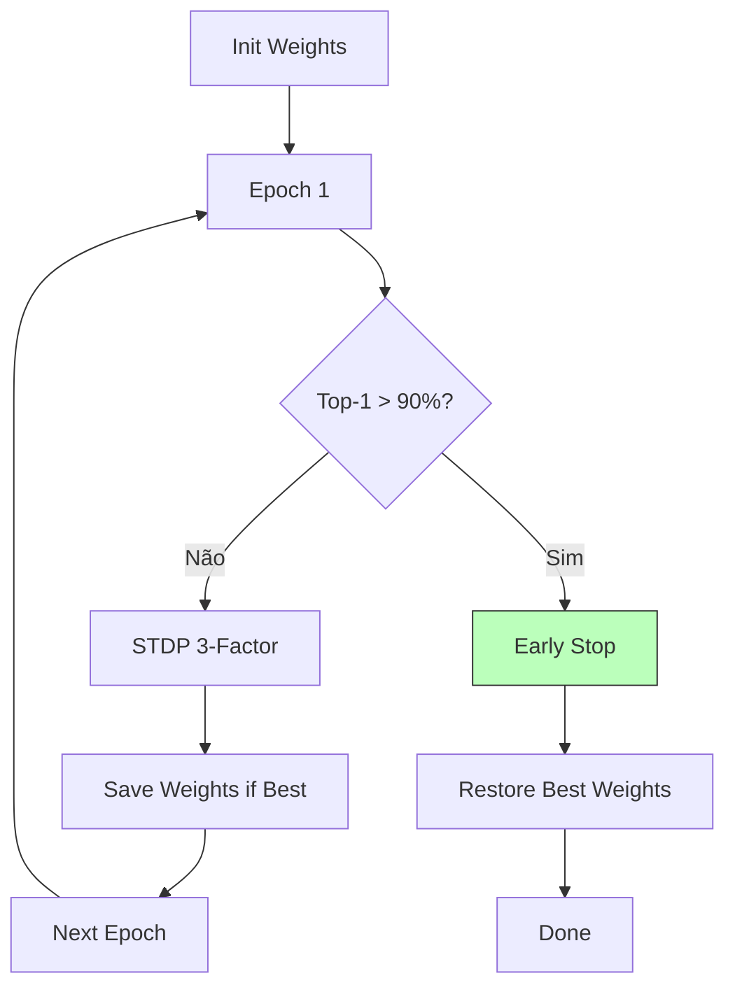
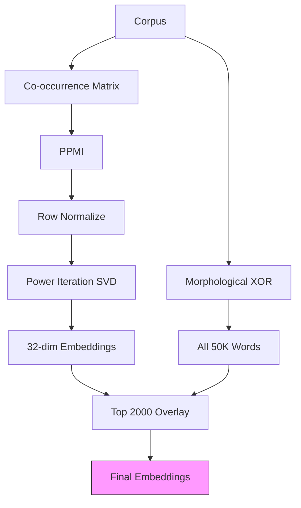
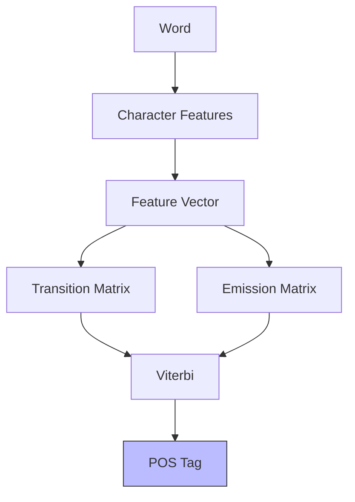
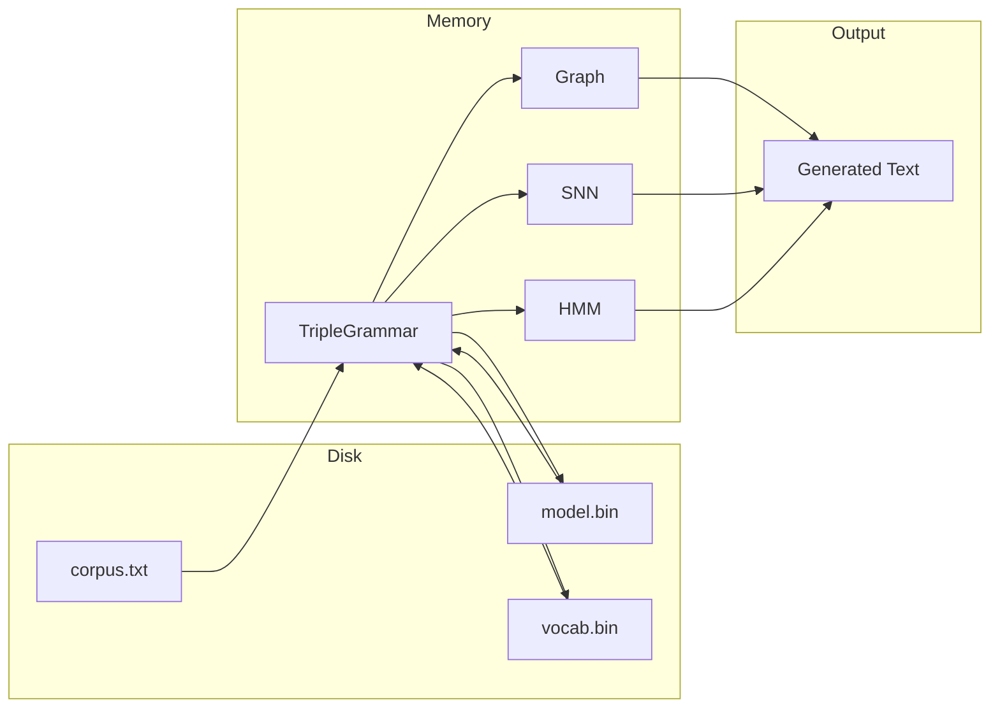
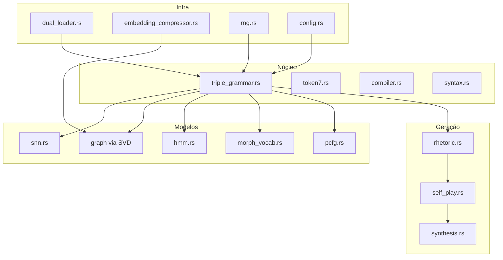

# Amadeus - Diagramas

## Arquitetura Geral



## Pipeline de Treinamento



## Geração de Texto



## Classes Principais



## SNN - Treinamento Iterativo



## GRAPH - Embeddings



## HMM - POS Tagging



## MorphVocab - Tokenização

```mermaid
flowchart TD
    A[Word "correndo"] --> B[Match Suffix]
    B --> C["correndo" → "corrend" + "o"]
    C --> D[Match Prefix]
    D --> E["corrend" → "co" + "rrend"]
    E --> F[Components]
    F --> G[ID: 12345]

    style G fill:#bfb,stroke:#333
```

## Data Flow



## Módulos


